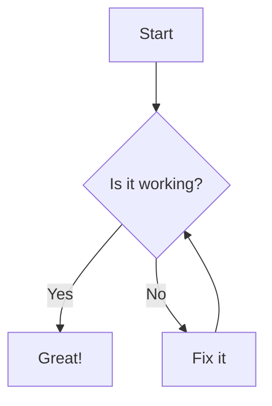

# JuanMa Mermaid Diagram Block

[](https://github.com/juanmaguitar/mermaid-diagram/actions/workflows/plugin-check.yml)
[](https://github.com/juanmaguitar/mermaid-diagram/actions/workflows/phpcs.yml)
[](https://github.com/juanmaguitar/mermaid-diagram/actions/workflows/phpstan.yml)
[](https://www.gnu.org/licenses/old-licenses/gpl-2.0.en.html)
[](https://wordpress.org)
[](https://php.net)

A WordPress block plugin that enables you to create beautiful diagrams and flowcharts using Mermaid syntax directly in your WordPress posts and pages.

## Description

The JuanMa Mermaid Diagram Block integrates the powerful Mermaid.js library into WordPress, allowing you to create various types of diagrams using simple text-based syntax. Perfect for documentation, tutorials, technical blogs, and any content that benefits from visual representations.

The MVP of this block was created using [Telex](https://github.com/wpcodelabs/telex), showcasing how quickly powerful WordPress blocks can be built with AI assistance. Read about the development process in this blog post: [Playing with Telex: Building a Mermaid Diagram Block in Just a Few Prompts](https://juanma.codes/2025/09/19/playing-with-telex-building-a-mermaid-diagram-block-in-just-a-few-prompts/).

## Features

- **Live Preview**: See your diagrams render in real-time as you type in the block editor
- **Multiple Diagram Types**: Support for flowcharts, sequence diagrams, class diagrams, state diagrams, and more
- **WordPress Interactivity API**: Built using WordPress's modern Interactivity API for optimal performance
- **Optimized Loading**: Mermaid.js library loads only when the block is present on the page
- **Block Alignment**: Support for various alignment options (left, center, right, wide, full)

## Installation

1. Download the plugin or clone this repository
2. Place it in your WordPress `/wp-content/plugins/` directory
3. Run `npm install` to install dependencies
4. Run `npm run build` to build the block assets
5. Activate the plugin through the WordPress admin panel

## Development

### Prerequisites

- Node.js (v14 or higher)
- npm or yarn
- WordPress development environment

### Setup

```bash
# Install dependencies
npm install

# Start development server
npm run start

# Build for production
npm run build
```

### Local Development Environment

The plugin includes wp-env for local development:

```bash
# Start local WordPress environment
npm run env:start

# Stop the environment
npm run env:stop

# Access the environment bash
npm run env:bash

# Clean and reset environment
npm run env:reset
```

### Available Scripts

- `npm run build` - Build the block for production
- `npm run start` - Start development mode with hot reload
- `npm run lint:js` - Lint JavaScript files
- `npm run lint:css` - Lint CSS files
- `npm run format` - Format code using WordPress coding standards
- `npm run plugin-zip` - Create a plugin zip file for distribution

## Usage

1. Add a new block in the WordPress editor
2. Search for "Mermaid Diagram"
3. Insert the block
4. Write your Mermaid syntax in the editor
5. The diagram will render automatically

### Example Mermaid Syntax



## Supported Diagram Types

- Flowcharts
- Sequence Diagrams
- Class Diagrams
- State Diagrams
- Entity Relationship Diagrams
- Gantt Charts
- Pie Charts
- Git Graphs
- User Journey Maps

For complete Mermaid syntax documentation, visit [Mermaid.js Documentation](https://mermaid.js.org/).

## Requirements

- WordPress 6.1 or higher
- PHP 7.0 or higher

## License

This plugin is licensed under GPLv2 or later. See the [LICENSE](https://www.gnu.org/licenses/gpl-2.0.html) file for details.

## Author

**JuanMa Garrido**
Email: juanma.garrido@gmail.com

## Contributing

Contributions are welcome! Please feel free to submit a Pull Request.

## Support

For issues, questions, or feature requests, please open an issue on the GitHub repository.